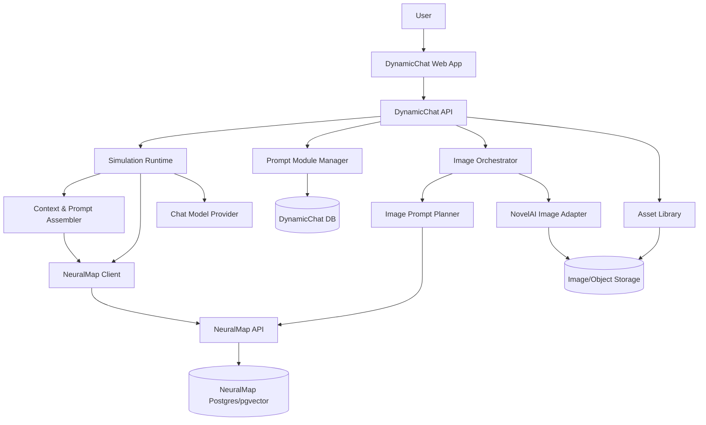
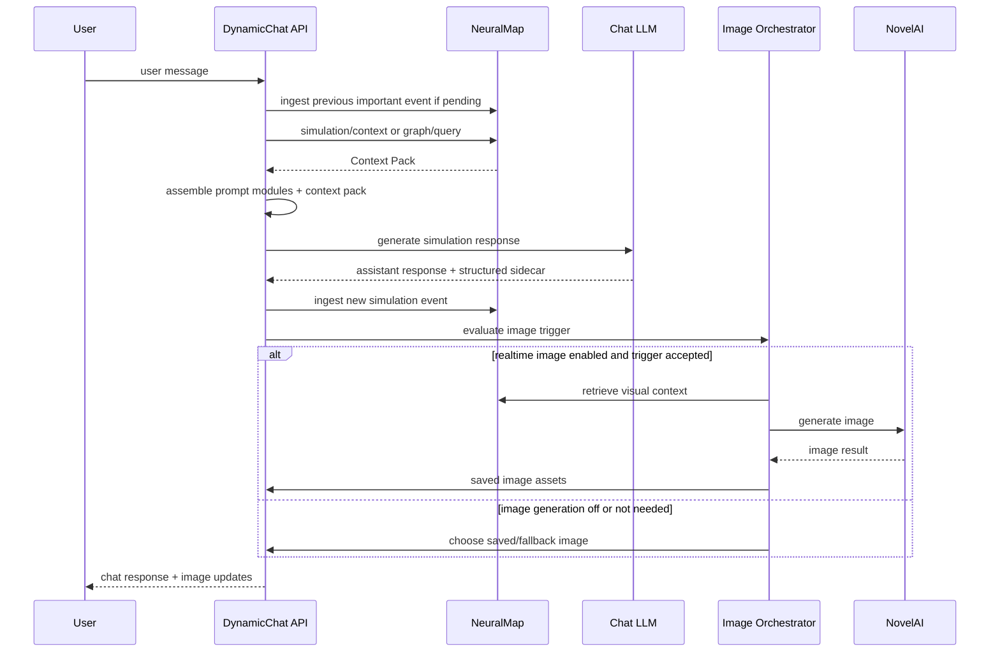

# AI 시뮬레이션 챗 프로그램 계획 청사진

작성일: 2026-05-04  
대상 독자: DynamicChat 개발자, 제품 기획자, 에이전트/메모리 시스템 구현자  
문서 유형: 설계 설명 + 구현 기준서

## 1. 한 줄 목표

DynamicChat은 사용자가 프롬프트와 설정을 구성하면 AI가 장기 시뮬레이션을 진행하고, 필요한 설정만 RAG로 불러오며, 문맥상 필요한 순간 NovelAI 기반 이미지를 생성하거나 저장 이미지를 출력하는 시뮬레이션 챗 프로그램이다.

핵심 원칙은 다음이다.

- 대화 세션은 짧게 유지하고, 시뮬레이션 상태는 데이터베이스와 NeuralMap 그래프 메모리에 저장한다.
- 방대한 설정 프롬프트는 항상 통째로 넣지 않고, 모듈화된 프롬프트 + RAG + 그래프 확장으로 필요한 조각만 주입한다.
- 이미지 생성은 채팅의 부가기능이 아니라 코어 루프다. 채팅 응답, 장면 상태, 캐릭터 상태, 사용자가 지정한 이미지 규칙을 함께 보고 생성 여부와 프롬프트를 결정한다.
- 실시간 이미지 생성이 꺼져 있어도 저장 이미지와 캐릭터/장면 에셋으로 시뮬레이션은 계속 자연스럽게 진행되어야 한다.

## 2. 범위

### 포함

- 기존 AI 채팅처럼 프롬프트를 입력하고 시뮬레이션을 진행하는 채팅 UI
- 메인 프롬프트와 서브 프롬프트 트리
- 캐릭터, 세계관, 장면, 규칙, 이미지 프롬프트용 모듈
- RAG 기반 설정 검색과 NeuralMap 기반 장기 기억
- 세션 초기화 후에도 이어지는 시뮬레이션 연속성
- NovelAI 이미지 생성 어댑터
- 저장 이미지/생성 이미지 출력과 이미지 라이브러리
- 이미지 생성 수량, 모델, 해상도, step, guidance, 안전 등급, 사용자 규정 설정
- 캐릭터별 이미지 프롬프트 매핑
- 메모리/컨텍스트/이미지 생성 근거를 확인할 수 있는 운영 화면

### 제외 또는 후순위

- 자체 이미지 생성 모델 학습
- NovelAI 외 다중 이미지 공급자 동시 최적화
- 완전 자동 멀티 에이전트 오케스트레이션의 1차 MVP 내 완성
- 공개 SaaS 수준의 결제/조직 관리

## 3. 현재 NeuralMap 검토 결과

NeuralMap은 DynamicChat의 장기 기억 계층으로 활용하기에 방향성이 잘 맞는다.

이미 제공되는 기능:

- `POST /ingest/simulation-event`: 시뮬레이션 이벤트를 Session, Task, Person 노드와 chunk로 저장
- `POST /simulation/context`: 새 세션에서 이어갈 Context Pack 생성
- `POST /graph/query`: hybrid 검색 + 그래프 neighborhood 확장
- `POST /context/compose`: 토큰 예산 안에서 Context Pack 생성
- `POST /context/handoff`: 세션 전환용 Handoff Pack 생성
- Postgres + pgvector 스키마, graph nodes/edges/chunks/context packs/handoff packs/trace spans
- retrieval, graph-neighborhood, prompt-segment, summary, response cache
- Workbench 기반 graph, cache, trace, timeline 관찰

DynamicChat에 바로 쓸 수 있는 방식:

- 대화 턴마다 중요한 사건을 NeuralMap에 `simulation-event`로 적재한다.
- 새 LLM 세션을 시작할 때 `/simulation/context`를 호출해 이전 세션의 핵심 기억만 가져온다.
- 프롬프트 모듈과 캐릭터 설정은 DynamicChat DB에 저장하되, 검색 가능한 문서/노드 형태로 NeuralMap에도 동기화한다.
- NeuralMap Context Pack은 LLM에 넣을 "증거 기반 기억 묶음"으로 사용하고, DynamicChat Prompt Assembler가 시스템 프롬프트와 사용자 설정을 최종 조립한다.

### 책임 경계

NeuralMap은 범용 지식 기반 프레임워크로 유지한다. 따라서 DynamicChat 전용 기능은 NeuralMap에 직접 구현하지 않는다.

DynamicChat이 직접 책임지는 영역:

- 프롬프트 트리 편집 UX
- 캐릭터, 세계관, 장면, 이미지 프롬프트 도메인 모델
- NovelAI 설정, 이미지 생성 정책, 안전 등급, 사용자 규정
- 채팅 화면, 이미지 라이브러리, 생성 job UX
- DynamicChat 전용 memory category와 이미지 cue 해석

NeuralMap에 제안할 수 있는 영역:

- 어떤 앱에도 쓸 수 있는 content module metadata와 activation-aware retrieval
- 긴 이벤트 스트림을 압축하는 범용 salience/consolidation
- 범용 agent registry와 per-agent context composition
- 외부 embedding provider, vector backfill, retrieval 품질 개선
- tenant/workspace/project 단위 scoped retrieval, redaction, audit

아래 Linear 이슈는 DynamicChat 전용 구현이 아니라 NeuralMap의 범용 성능/구조 개선으로 재정리했다. DynamicChat은 해당 개선이 없더라도 기존 NeuralMap API와 자체 DB/API 계층으로 먼저 구현한다.

| Linear | 제목 | 이유 |
| --- | --- | --- |
| [AIN-12](https://linear.app/aineuralmap/issue/AIN-12/content-module-metadata-and-activation-aware-retrieval) | Content module metadata and activation-aware retrieval | 앱별 프롬프트/문서/규칙 모듈을 범용 metadata와 검색 힌트로 다루기 |
| [AIN-13](https://linear.app/aineuralmap/issue/AIN-13/generic-event-salience-and-memory-consolidation) | Generic event salience and memory consolidation | 긴 이벤트 스트림을 범용 사실/요약/상태 변화로 압축해 토큰 절감 |
| [AIN-14](https://linear.app/aineuralmap/issue/AIN-14/phase-5-generic-agent-registry-and-per-agent-context-composer) | Generic agent registry and per-agent context composer | 여러 앱에서 agent role별 context pack을 분리해 구성 |
| [AIN-15](https://linear.app/aineuralmap/issue/AIN-15/external-embeddings-and-vector-backfill-controls) | External embeddings and vector backfill controls | 대규모/다국어/태그성 지식 검색 품질과 운영성 개선 |
| [AIN-16](https://linear.app/aineuralmap/issue/AIN-16/tenant-safe-scoped-retrieval-and-redaction) | Tenant-safe scoped retrieval and redaction | 외부 앱이 NeuralMap을 공유 지식 기반으로 쓸 때 필수인 격리/삭제/감사 |

## 4. 전체 아키텍처



역할 분리:

- DynamicChat DB: 제품 엔티티, UI 설정, 프롬프트 트리 원본, 캐릭터 설정, 이미지 생성 설정, 에셋 메타데이터
- NeuralMap DB: 검색 가능한 기억, 이벤트, 요약, 관계, Context Pack, Handoff Pack, trace
- Object Storage: 저장 이미지, 생성 이미지, 썸네일, 원본 메타데이터
- LLM Provider: 채팅/시뮬레이션 텍스트 생성
- NovelAI Adapter: 이미지 생성 전용 외부 API 캡슐화

## 5. 핵심 도메인 모델

### Simulation

```ts
interface Simulation {
  id: string;
  ownerId: string;
  title: string;
  description?: string;
  activeSessionId: string;
  defaultChatModelProfile: string;
  realtimeImageEnabled: boolean;
  createdAt: string;
  updatedAt: string;
}
```

### PromptModule

```ts
type PromptModuleKind =
  | "main_prompt"
  | "sub_prompt"
  | "character_prompt"
  | "world_lore"
  | "scene_rule"
  | "image_prompt_profile"
  | "safety_policy"
  | "style_guide";

interface PromptModule {
  id: string;
  simulationId: string;
  parentId?: string;
  kind: PromptModuleKind;
  title: string;
  body: string;
  enabled: boolean;
  priority: number;
  activationTags: string[];
  characterId?: string;
  tokenPolicy: "always" | "rag" | "manual" | "disabled";
  version: number;
  createdAt: string;
  updatedAt: string;
}
```

### CharacterVisualProfile

```ts
interface CharacterVisualProfile {
  id: string;
  simulationId: string;
  characterId: string;
  displayName: string;
  positivePrompt: string;
  negativePrompt?: string;
  outfitPrompts?: Record<string, string>;
  expressionPrompts?: Record<string, string>;
  referenceImageAssetIds: string[];
  defaultSafetyLevel: ImageSafetyLevel;
}
```

### ImageGenerationProfile

```ts
type ImageSafetyLevel = "safe" | "sensitive" | "suggestive" | "explicit";

interface ImageGenerationProfile {
  id: string;
  simulationId: string;
  enabled: boolean;
  provider: "novelai";
  model: string;
  width: number;
  height: number;
  steps: number;
  promptGuidance: number;
  countMin: number;
  countMax: number;
  qualityPrompt: string;
  stylePrompt?: string;
  artistPrompt?: string;
  negativePrompt: string;
  safetyLevel: ImageSafetyLevel;
  userRules: string;
  triggerPolicy: ImageTriggerPolicy;
}
```

### ImageGenerationJob

```ts
interface ImageGenerationJob {
  id: string;
  simulationId: string;
  sessionId: string;
  turnId: string;
  status: "queued" | "planning" | "generating" | "completed" | "failed" | "canceled";
  reason: string;
  prompt: string;
  negativePrompt: string;
  providerPayload: Record<string, unknown>;
  assetIds: string[];
  contextNodeIds: string[];
  createdAt: string;
  completedAt?: string;
}
```

## 6. 프롬프트와 RAG 설계

### 프롬프트 트리

사용자는 메인 프롬프트 아래에 `+` 버튼으로 서브 프롬프트를 추가한다.

권장 기본 타입:

- 메인 프롬프트: 시뮬레이션의 최상위 목적, 세계관, 응답 규칙
- 캐릭터 프롬프트: 성격, 말투, 관계, 금지 행동, 이미지 매핑
- 세계관/로어: 장소, 역사, 세력, 규칙
- 장면 규칙: 현재 씬의 목표, 분위기, 진행 제약
- 이미지 프롬프트 프로필: 캐릭터 외형, 의상, 표정, 화풍, 구도
- 안전/출력 정책: 사용자별 허용 범위와 금지 규칙

### 토큰 정책

각 모듈은 다음 중 하나의 토큰 정책을 가진다.

- `always`: 항상 포함. 짧고 핵심적인 시스템 규칙에만 사용
- `rag`: 검색 결과가 관련 있을 때만 포함
- `manual`: 사용자가 현재 턴에 명시적으로 선택했을 때 포함
- `disabled`: 저장은 하지만 사용하지 않음

### 컨텍스트 조립 순서

1. 고정 시스템 지시문
2. 현재 사용자 입력과 최근 대화 window
3. 항상 포함 프롬프트 모듈
4. NeuralMap Context Pack: 장기 기억, 이전 세션 요약, 관계/상태
5. RAG로 선택된 프롬프트 모듈
6. 현재 장면/캐릭터 상태
7. 이미지 생성 여부 판단을 위한 visual context
8. 출력 형식 계약

### NeuralMap 호출 예시

```json
{
  "simulation_id": "sim_123",
  "session_id": "session_12",
  "new_session_id": "session_13",
  "agent_id": "narrative-agent",
  "query": "현재 장면, 관련 캐릭터 기억, 사용자가 언급한 약속과 갈등",
  "token_budget": 3200
}
```

DynamicChat은 이 응답의 `pack.evidence`, `pack.decisions`, `pack.blockers`, `pack.metadata.context_summary`를 최종 LLM 프롬프트에 압축 삽입한다.

## 7. 채팅 턴 실행 흐름



LLM 응답은 가능하면 자연어 본문과 구조화 sidecar를 함께 만든다.

```json
{
  "assistant_text": "...",
  "memory_events": [
    {
      "importance": 0.86,
      "tags": ["promise", "relationship"],
      "content": "..."
    }
  ],
  "image_cues": {
    "should_generate": true,
    "reason": "새 장면 전환과 캐릭터 감정 변화",
    "characters": ["char_aria"],
    "tags": ["close-up", "rainy street", "tense expression"]
  }
}
```

## 8. 실시간 이미지 생성 설계

### 생성 트리거

자동 생성 후보:

- 새 캐릭터 등장
- 장면/장소 전환
- 감정 변화가 큰 순간
- 시각적으로 중요한 행동
- 사용자가 직접 "그려줘", "이미지로 보여줘" 요청
- 일정 턴마다 대표 장면 갱신

생성 억제 조건:

- 직전 이미지와 장면 차이가 작음
- 생성 쿨다운 미경과
- 사용자가 실시간 생성을 끔
- 비용/수량 제한 초과
- 안전 등급 또는 사용자 규정에 맞지 않음

### 프롬프트 조립

이미지 프롬프트는 다음 레이어를 순서대로 합친다.

1. 전역 품질 프롬프트
2. 작가/화풍/스타일 프롬프트
3. 캐릭터별 visual profile
4. 현재 장면, 배경, 구도, 카메라
5. 감정, 표정, 의상, 행동
6. 사용자 입력 규정
7. negative prompt
8. 안전 등급 필터

예시 구조:

```json
{
  "positive": "quality tags, style tags, 1girl, aria character tags, rainy alley, tense expression, cinematic lighting",
  "negative": "low quality, bad anatomy, unwanted content...",
  "settings": {
    "provider": "novelai",
    "model": "configured-by-user",
    "width": 1024,
    "height": 1024,
    "steps": 28,
    "promptGuidance": 5.0,
    "count": 2
  }
}
```

NovelAI 공식 문서는 이미지 생성에서 해상도, 이미지 수, steps, prompt guidance, image2image strength/noise, undesired content, multi-character prompting 등을 주요 설정으로 다룬다. 구현 시 실제 API payload는 공식 문서와 현재 계정/모델에서 재검증해야 한다.

### 생성 모드

- `stored_only`: 저장 이미지와 수동 등록 에셋만 사용
- `realtime_auto`: 문맥 판단으로 자동 생성
- `realtime_confirm`: 생성 전 사용자 확인
- `manual`: 사용자가 버튼을 눌렀을 때만 생성

### 이미지 저장 전략

생성 결과는 모두 Asset Library에 저장한다.

저장 메타데이터:

- simulation/session/turn/job ID
- 사용된 prompt/negative/settings
- 관련 캐릭터/장면/NeuralMap node IDs
- 안전 등급
- seed 또는 재현 가능한 provider metadata
- 사용자가 선택한 대표 이미지 여부

## 9. 에이전트 설계

MVP에서는 하나의 프로세스 안에서 순차 실행하고, NeuralMap Phase 5가 준비되면 멀티 에이전트 런타임으로 분리한다.

권장 에이전트:

- Narrative Agent: 채팅 응답과 시뮬레이션 진행
- Memory Curator: 중요한 사건, 관계, 상태를 NeuralMap에 적재할 형태로 정리
- Prompt Retrieval Agent: 프롬프트 모듈/RAG 후보 선택
- Image Prompt Planner: 이미지 생성 여부와 NovelAI 프롬프트 작성
- Image Policy Validator: 사용자 규정, 안전 등급, 금지 조건 검증
- Continuity Validator: 세션 초기화 후 이전 상태가 유지되는지 검사

## 10. 세션 초기화와 연속성

세션 초기화는 "대화 리셋"이지 "시뮬레이션 리셋"이 아니다.

흐름:

1. 현재 세션의 마지막 상태를 NeuralMap에 simulation event로 저장
2. `/context/handoff`로 Handoff Pack 생성
3. 새 LLM 세션 ID 생성
4. `/simulation/context`로 새 세션용 Context Pack 생성
5. 프롬프트 모듈과 현재 상태를 재조립
6. 첫 응답 전 Continuity Validator가 핵심 기억 누락 여부를 점검

성공 기준:

- 사용자가 세션 초기화를 눌러도 캐릭터 관계, 장면 상태, 약속, 인벤토리, 세계관 사건이 유지된다.
- 이전 전체 transcript를 넣지 않아도 이어진다.
- Context Pack이 어떤 memory node를 참조했는지 UI에서 확인 가능하다.

## 11. API 청사진

DynamicChat API:

- `POST /simulations`: 시뮬레이션 생성
- `GET /simulations/:id`: 시뮬레이션 상세 조회
- `POST /simulations/:id/prompt-modules`: 프롬프트 모듈 생성
- `PATCH /prompt-modules/:id`: 프롬프트 모듈 수정/비활성화/버전 갱신
- `POST /simulations/:id/chat/turns`: 사용자 메시지 처리
- `POST /simulations/:id/sessions/reset`: LLM 세션 초기화와 NeuralMap 연속성 복구
- `POST /simulations/:id/image-jobs`: 수동 이미지 생성
- `GET /simulations/:id/assets`: 이미지 라이브러리
- `POST /image-jobs/:id/cancel`: 생성 취소
- `GET /image-jobs/:id`: 생성 상태 조회

NeuralMap 연동:

- `POST /ingest/simulation-event`
- `POST /simulation/context`
- `POST /graph/query`
- `POST /context/compose`
- `POST /context/handoff`
- 프롬프트 모듈 원본은 DynamicChat API에서 관리하고, NeuralMap에는 현재 `POST /ingest/document` 또는 metadata가 있는 generic node/chunk로 동기화
- 향후 AIN-12 완료 후에는 DynamicChat 전용 prompt API가 아니라 범용 content module metadata/API를 사용

## 12. UI 청사진

### 메인 채팅 화면

- 중앙: 채팅 타임라인
- 우측: 현재 이미지/이미지 후보/생성 상태
- 좌측: 시뮬레이션, 캐릭터, 프롬프트 트리
- 하단 또는 우측 접이식 패널: 현재 참조된 기억, 프롬프트 모듈, 이미지 프롬프트 근거

### 프롬프트 트리 편집기

- `+` 버튼으로 서브 프롬프트 추가
- 타입 선택: 메인, 캐릭터, 세계관, 장면, 이미지, 안전 정책
- 활성화 토글
- 토큰 정책 선택
- activation tags 입력
- 캐릭터 전용 모듈 연결
- "이 모듈이 언제 쓰였는지" 히스토리 표시

### 이미지 설정 화면

- 실시간 생성 on/off
- 생성 모드 선택
- 모델, 해상도, steps, guidance, 생성 수량
- 품질 프롬프트, 작가/화풍 프롬프트, negative prompt
- 안전 등급
- 사용자 규정 입력
- 캐릭터별 visual profile 매핑
- 비용/쿨다운/턴당 생성 제한

### 메모리 인스펙터

- 현재 턴에 포함된 NeuralMap Context Pack
- 포함된 memory node와 이유
- 최근 저장된 simulation events
- 세션 초기화 전후 handoff 비교
- 잘못된 기억 삭제/수정 요청

## 13. 구현 단계

### Phase 0. 프로젝트 스캐폴딩

목표:

- DynamicChat 앱 골격 생성
- 환경변수, DB, API 클라이언트, NovelAI adapter 인터페이스 준비

산출물:

- Web app
- API server
- DynamicChat DB schema
- NeuralMap client
- Object storage adapter

### Phase 1. 채팅 MVP와 NeuralMap 이벤트 적재

목표:

- 기본 채팅
- 최근 대화 window + 단순 시스템 프롬프트
- 턴마다 중요한 이벤트를 NeuralMap에 저장
- 새 세션에서 `/simulation/context`로 이어가기

완료 기준:

- 30턴 이상 대화 후 세션 초기화해도 핵심 사실을 회수한다.
- 저장된 NeuralMap event와 Context Pack ID를 UI에서 볼 수 있다.

### Phase 2. 프롬프트 모듈/RAG

목표:

- 프롬프트 트리 편집기
- 모듈별 token policy
- DynamicChat DB 저장
- NeuralMap document 또는 prompt-module 형태로 동기화
- 현재 턴 관련 모듈만 검색/주입

완료 기준:

- 방대한 설정 프롬프트를 통째로 넣지 않고 캐릭터/장면 관련 모듈만 포함한다.
- 사용자는 어떤 모듈이 쓰였는지 확인할 수 있다.

### Phase 3. 이미지 생성 파이프라인

목표:

- 이미지 생성 trigger 판단
- Image Prompt Planner
- NovelAI adapter
- 생성 job queue
- Asset Library
- stored_only/realtime_auto/realtime_confirm/manual 모드

완료 기준:

- 새 장면/캐릭터/중요 행동에서 이미지 생성 후보가 생긴다.
- 실시간 생성 off 상태에서는 저장 이미지 fallback이 작동한다.
- 생성 프롬프트와 근거가 job metadata에 저장된다.

### Phase 4. 기억 고도화와 세션 초기화 안정화

목표:

- Memory Curator
- 장기 사실/관계/상태 추출
- 중복/모순 처리
- 세션 reset UX

완료 기준:

- 긴 transcript를 재주입하지 않고도 주요 관계와 상태가 유지된다.
- 잘못된 기억을 UI에서 제거하거나 수정할 수 있다.

### Phase 5. 운영/관찰/품질 평가

목표:

- Context Pack, image job, prompt module usage trace
- 이미지 생성 품질 피드백
- 기억 회수 평가 세트
- 비용/지연/토큰 대시보드

완료 기준:

- 한 턴의 채팅 응답과 이미지 생성이 어떤 설정/기억을 참조했는지 추적 가능하다.
- RAG 토큰 절감과 recall 품질을 평가할 수 있다.

### Phase 6. 프로덕션 하드닝

목표:

- 사용자/시뮬레이션별 격리
- API 키 암호화
- rate limiting
- redaction/delete
- 백업/마이그레이션

완료 기준:

- 사용자 A의 프롬프트/기억/이미지가 사용자 B에게 검색되지 않는다.
- 삭제한 기억과 이미지 메타데이터가 Context Pack에 다시 나타나지 않는다.

## 14. 리스크와 대응

| 리스크 | 영향 | 대응 |
| --- | --- | --- |
| RAG가 중요한 설정을 누락 | 캐릭터 붕괴, 세계관 불일치 | `always` 모듈 최소화, 중요도 점수, Continuity Validator, 검색 근거 UI |
| 이미지 생성이 너무 잦음 | 비용 증가, 대화 흐름 방해 | trigger threshold, cooldown, turn budget, confirm mode |
| NovelAI API/모델 변경 | 생성 실패, 설정 불일치 | provider adapter 캡슐화, payload version 저장, 공식 문서 기반 재검증 |
| 세션 초기화 후 기억 누락 | 사용자 신뢰 하락 | Handoff Pack + Context Pack + memory eval |
| 사용자가 만든 방대한 프롬프트 관리 어려움 | UX 복잡도 증가 | 타입 템플릿, 모듈 검색, 폴더/태그, 사용 히스토리 |
| 멀티테넌트 격리 부족 | 보안 문제 | AIN-16 선행, scope 필드 강제, API 인증 |

## 15. MVP 완료 기준

MVP는 다음이 가능하면 완료로 본다.

- 사용자가 시뮬레이션을 만들고 메인 프롬프트를 입력한다.
- 캐릭터 프롬프트와 이미지 프롬프트를 분리 저장한다.
- 채팅이 진행되며 중요한 이벤트가 NeuralMap에 저장된다.
- 세션 초기화 후에도 이전 핵심 기억을 회수한다.
- 실시간 이미지 생성을 켜면 문맥상 필요한 순간 이미지 job이 생성된다.
- 실시간 이미지 생성을 끄면 저장 이미지 fallback만 사용한다.
- 각 턴에서 사용된 기억, 프롬프트 모듈, 이미지 생성 근거를 확인할 수 있다.

## 16. 참고 자료

- NeuralMap README: `S:\Project\NeuralMap\README.md`
- NeuralMap simulation continuity guide: `S:\Project\NeuralMap\docs\how-to\simulation-continuity-api.md`
- NeuralMap blueprint coverage: `S:\Project\NeuralMap\docs\progress\blueprint-coverage.md`
- NovelAI Image Generation docs: https://docs.novelai.net/en/image/
- NovelAI scripting generation docs: https://docs.novelai.net/en/scripting/generation-api/
